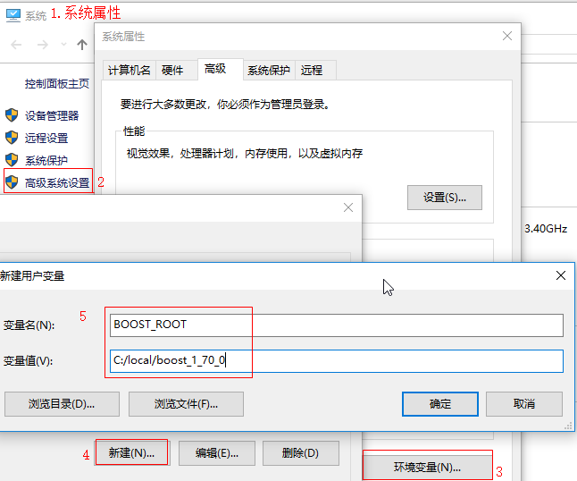

# 简介
  《魔兽世界:巫妖王之怒》模拟服务器TrinityCore在Windows下的安装指南,参考[官方Wiki的Install Guide](https://trinitycore.atlassian.net/wiki/spaces/tc/pages/2130077/Installation+Guide)

# 一、Windows 环境需求
- CPU 支持 SSE2 指令集
- Boost ≥ 1.66(最新稳定推荐)
- MySQL ≥ 5.6.0 以及 MySQL 5.7.x
- OpenSSL ≥ 1.0.x
- CMake ≥ 3.8.2(最新稳定推荐)
- MicroSoft Visual Studio (Community) ≥ (2017)(Desktop)

## 1.安装 Git
- 安装[Git](https://git-scm.com)及图形界面[TortoiseGit](https://tortoisegit.org)
- 注意,安装Git时,在路径选择那里选择"RunGit from the Windows Command Prompt"

## 2.安装 IDE
- 下载并安装[Visual Studio 2019](https://visualstudio.microsoft.com/zh-hans/)
- 工作负载选择"使用C++的桌面开发"
- 若需离线安装,参考[VS官方指南](https://docs.microsoft.com/zh-cn/visualstudio/install/create-an-offline-installation-of-visual-studio?view=vs-2019):
  vs_community.exe --layout c:\vslayout --add Microsoft.VisualStudio.Workload.NativeDesktop --includeRecommended --lang zh-CN

## 3.安装 MySQL Community
- 下载5.7安装包 -> 进入[官网](https://dev.mysql.com/downloads/mysql/5.7.html) -> 点Download
- 进入下载页面点最下方的蓝色小字"No thanks, just start my download."
- 安装快完成时,确认"Launch the MySQL Instance Configuration Wizard"已选择,之后点"Finish"
- 在Configuration配置时,保持默认设置即可,注意记住用户名和密码,建议注册为服务可随Windows开机启动

## 4.安装数据库管理软件
- [Navicat Premium](https://www.navicat.com.cn/products)
- MySQL Workbench（MySQL官方出品,安装可选,使用不太友好,是唯一可以建立模型的软件）
- 通过管理软件连接数据库(HOST/IP为"127.0.0.1"/"localhost"),输入设置的用户名和密码测试是否成功连接

## 5.安装 Boost
- 下载[Boost](https://www.boost.org/users/download),点击下方连接"Prebuilt windows binaries"(当然也可自行编译,耗时稍长)
- VS 2019 适配Boost的最小版本为[1.70](https://sourceforge.net/projects/boost/files/boost-binaries/1.70.0/),选择msvc-14.2
- 安装到默认路径(C:\local\boost_1_xx_0\),然后将路径添加到名为"BOOST_ROOT"的环境变量中,比如"C:/local/boost_1_70_0".确保没有末尾斜杠,如下图所示：

## 6.安装 CMake
- 下载并安装[CMake](https://cmake.org/) ,只选择Latest Release版本,推荐使用64bit版本
- 如有多个版本的MySQL server,使用特定版本需将cmake指向该目录.将MySQL安装目录添加到环境变量"MYSQL_ROOT",如"c：/wamp/bin/mysql/mysql5.7.19".注意使用"/"而非"\\"

## 7.安装OpenSSL
- 下载[OpenSSL](http://slproweb.com/products/Win32OpenSSL.html),推荐64bit,选择"Win64 OpenSSL v1.1.x",不要选择"Light"版本
- 安装过程中若提示没有Visual C++库,请到网上自行[下载](https://www.microsoft.com/en-us/download/details.aspx?id=29)安装.

## 8.可选
- 若在不同PC上编译/运行Trinity,需安装[Visual C++ 2017](https://go.microsoft.com/fwlink/?LinkId=746572)
- *注意:TrinityCore不能在Windows XP / Windows 2003 上运行*

## 二、源码拉取和编译
## 1.从GIT拉取源码
- 配置TortoiseGit,如有其他问题请参考[Git教程](https://www.runoob.com/git/git-tutorial.html)
  + 开始菜单 -> 找到并打开"TortoiseGit\PuTTYgen" -> 选择"RSA" -> 点击"Generate" -> 随意晃动鼠标直到跑完进度条 -> 点"Save private key"保存**私钥**(*p*) -> 复制Key下方文本框中的**Public Key**
  + 登录[GitHub](https://github.com) -> 点开用户头像下拉框选择"Settings" -> 点"SSH and GPG keys" -> 点"New SSH Key"
  + "Title"输入标题(*p*) -> "Key"将之前PuTTYgen中生成的**Public Key**复制进去 -> 点"Add SSH Key"完成
  + 开始菜单 -> 找到并打开"TortoiseGit\Settings" -> 点"NetWork" -> 点"SSH Client"的"Browse..." -> 进入"C:\Program Files\TortoiseGit\bin\"目录,选"TortoiseGitPlink.exe"
- 打开[Trinity源码库](https://github.com/TrinityCore/TrinityCore) -> 点"Clone and download" -> 复制连接
- 创建目录如"D:\Trinity" -> 进入后点击鼠标右键,选择"Git Clone..."
  + "Directory:"填入"D:\Trinity\Source" -> 选中"Load Putty Key"并点"..."选中步骤1中保存的**私钥**(*p*) -> 点"OK"
- 等待下载完成后进入"Source"目录 -> 点右键选"TortoiseGit" -> "Switch/Checkout..." -> "Branch"选分支3.3.5 -> 点"OK" -> 切换到3.3.5a版本对应服务端源码

## 2.使用CMake配置和生成Visual C++解决方案
- 编译前先建立编译文件目录,比如"D:/Trinity/Build".
- 运行CMake -> 点击 Browse Source… -> 选择源码目录"D:/Trinity/Source"
- 点击 Browse Build… -> 选择编译目录"D:/Trinity/Build"
- 点击 Configure -> 确保"Use default native compilers"被选中 -> 选"Visual Studio 16 2019" -> 选"x64" -> 点Finish
- 确保"Tools"被选中(用于解包生成服务器所需资源),**之后更新源码重新编译源码时可不选**
- 再次点击Configure -> 点击Generate,生成VS解决方案所需的相关文件到"D:/Trinity/Build"中
- 点击 Open Project, 打开VS2019并打开项目源码

## 3.编译源码
- 等待VS2019加载完成"D:/Trinity/Build/TrinityCore.sln"
- 选择菜单中的"生成->配置管理器"打开编译配置界面 -> "活动解决方案配置"设为Release -> "活动解决方案平台"设为x64 (*需确保之前安装的软件全部是64位的*) -> "关闭"
- 在 "解决方案资源管理器" 中右键单击 ALL_BUILD 选择 "清理" -> 完毕后再次右键单击 ALL_BUILD 选择 "生成", 即开始编译源码了,约需3~30分钟,视电脑配置而定.
- 编译成功后,可在"D:\Trinity\Build\bin\Release"中找到编译好的文件
- 想要正常运行程序,需要如下文件：
  + libmySQL.dll – 从 *"C:\Program Files\MySQL\MySQL Server 5.x\lib"* 手动复制到目录
  + libeay32.dll ; ssleay32.dll – 从 *"C:\OpenSSL-Win64\bin"* 手动复制到目录
  + worldserver.conf.dist ; worldserver.exe ; authserver.conf.dist ; authserver.exe *由编译生成*

## 4.保持源码更新
- 在源码目录"D:\Trinity\Source"中点击右键 -> 选择"Git Sync" -> "Pull"
- 打开CMake -> Configure -> Generate -> Open Project 重新编译
- 运行 worldserver, 如果有sql脚本更新(可在命令行窗口看见)

# 三、提取资源文件 DBC Maps VMaps MMaps
1. 将"D:\Trinity\Build\bin\Release"中下述4个可执行文件复制到"WOW客户端"(3.3.5)根目录中
    + mapextractor.exe 提取dbc和cameras文件
    + vmap4extractor.exe 提取maps文件
    + mmaps_generator.exe 提取mmaps文件
    + vmap4assembler.exe 提取vmaps文件

2. 复制"D:\Trinity\Source\contrib\extractor.bat"批处理文件到客户端根目录中 -> 右键点击 extractor.bat -> 管理员模式运行

3. 输入1后回车,提取dbc和maps -> 等待提取结束后输入2回车,提取vmaps文件 → 3提取mmaps(耗时超过1小时,不可中断)

4. 提取结束后,将Cameras、dbc、maps、mmaps和vmaps 移动至服务端程序根目录"D:\Trinity\Build\bin\Release"中

# 四、安装数据库
1. 打开"D:\Trinity\Source\sql\create\create_mysql.sql" -> 设定用户名和密码 -> 执行脚本,创建相关数据库:
    + Auth：帐户数据库 - 保存用户名,密码,GM访问权限,区服信息等
    + Characters：角色数据库 - 保存角色,背包,银行物品,拍卖行信息等
    + World：世界数据库 - 保存游戏体验内容,如npc,任务,物品信息等

2. 下载数据库脚本,从官方源码库[下载sql](https://github.com/TrinityCore/TrinityCore/releases)
    + 注意不同的数据库脚本对应不同的分支,如 "TDB 335.xxxxx" 对应分支3.3.5
    + 下载后缀为 ".7z" 的文件, 需要 [7zip](https://www.7-zip.org) 解压
    + 将解压后的SQL脚本复制到worldserver.exe相同根目录下"D:\Trinity\Build\bin\Release"
    + 注意: 不需手动导入任何数据库;如计划手动导入,则需禁用配置文件"worldserver.conf"上的Updates.AutoSetup

3. 保持数据库更新
    + 更新源码后,每次启动"worldserver.exe"时,会自动执行最新的SQL升级脚本,无需人工干预.

# 五、Worldserver 和 Authserver配置
0. 对于几乎所有的基本设置场景,localhost (127.0.0.1) IP设置 以及 bindip(0.0.0.0) 默认值都应保持不变

1. 修改 authserver.conf 配置文件
    + 去掉authserver.conf.dist的".dist"后缀,用文本编辑器如[Notepad++](https://notepad-plus-plus.org/)打开,语言设为YAML
    + 找到数据源"MYSQL SETTINGS"配置域,修改 LoginDatabaseInfo = "localhost;3306;trinity;trinity;auth"

2. 修改 worldserve.conf 配置文件
    + 去掉worldserve.conf.dist的".dist"后缀 -> 打开 -> 找到"CONNECTIONS AND DIRECTORIES"配置域,修改:
      - LoginDatabaseInfo = "localhost;3306;*trinity;trinity*;auth"
      - WorldDatabaseInfo = "localhost;3306;*trinity;trinity*;world"
      - CharacterDatabaseInfo = "localhost;3306;*trinity;trinity*;characters"
    + 注意：如果你自己设定了用户名和密码,将斜体部分改为你的设定（*用户名,密码*）.

3. 修改服务器IP地址(本机测试可忽略该步骤)
    + 为Internet连接配置auth数据库的realmlist表,确保 authserver 将进入的客户端连接指向你实际的区服地址
    + 运行数据库管理工具 -> 打开auth数据库并 -> 打开realmlist表 -> 根据需要设置 address 字段
      - 局域网(192.168.x.x) - WoW与TrinityCore在同一网络(路由器)上的不同计算机上,改为服务器IP地址
      - 本地localhost(127.0.0.1) - WoW与TrinityCore在同一台计算机上且只有你在连接它,保持默认配置
      - 外部IP — 如需其他人能连接你的服务器,访问[地址](http://www.whatismyip.com/)获得你的外部IP地址

4. 将"auth.realmlist.gamebuild"字段设为你的WoW客户端版本号（国服为13930,台服为12340）.

# 六、启动服务器
1. 运行 authserver.exe - 登录与网关程序
    + 允许你输入用户名和密码来连接到区服选择界面

2. 运行 worldserver.exe - 游戏主程序
    + 允许您连接到所选区服本身,一旦进入游戏,如果不希望其他人连接到服务器,则可以安全地关闭authserver

3. 创建账号并授予GM权限,在worldserver.exe的DOS窗口中输入如下命令：
    - 创建账号: account create <user> <pass>, 示例: account create test test
    - 授予GM权限: account set gmlevel <user> 3 -1, 示例: account set gmlevel test 3 -1

# 七、配置WoW客户端
1. 进入客户端"World of Warcraft\Data\zhCN"目录 -> 打开"realmlist.wtf"文件 -> 配置为*五.4*步骤中的IP
    + 将第一行更改为:set realmlist *<realmlist表中的IP>*  示例: realmlist 127.0.0.1
    + (可选)如果用 WoW launch.exe 运行客户端,必须将set patchlist更改为与realmlist相同的ip/dns名称

2. 打开游戏,输入刚才创建的GM账号,在艾泽拉斯的世界中尽情遨游吧！

# [GM命令大全](https://trinitycore.atlassian.net/wiki/spaces/tc/pages/2130065/GM+Commands)

# [日志配置](https://trinitycore.atlassian.net/wiki/spaces/tc/pages/2130036/Logging+Configuration)