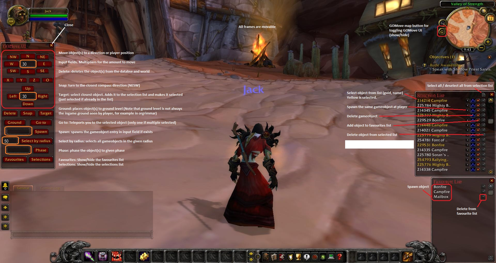

# GOMove 

#### About
GOMove is a script that allows you to move objects.

You no longer need to be at the point where you want to spawn an object
and you can fine tune the position of objects (rotation and x,y,z position)

Some features:
- Move objects (to compass directions and according to your character position)
- Favourite list
- Snap facing to a compass direction (N,E,W,S)
- Spawn an object again
- move to ground level

Source: http://rochet2.github.io/GOMove.html  
Original idea by [Mordred](https://www.youtube.com/watch?v=a0JVXJ07KUU)

#### Installation

Available as:
- Direct merge: https://github.com/Rochet2/TrinityCore/tree/gomove_3.3.5
- Diff: https://github.com/Rochet2/TrinityCore/compare/TrinityCore:3.3.5...gomove_3.3.5.diff
- Diff in github view: https://github.com/Rochet2/TrinityCore/compare/TrinityCore:3.3.5...gomove_3.3.5

Using direct merge:
- open git bash to source location
- do `git remote add rochet2 https://github.com/Rochet2/TrinityCore.git`
- do `git pull rochet2 gomove_3.3.5`
- use cmake and compile
- Copy the GOMove addon folder (GOMove folder with lua files inside) to `WowInstallFolder\Interface\AddOns`

Using diff:
- DO NOT COPY THE DIFF DIRECTLY! It causes apply to fail.
- download the diff by __right clicking__ the link and select __Save link as__
- place the downloaded `gomove_3.3.5.diff` to the source root folder
- open git bash to source location
- do `git apply gomove_3.3.5.diff`
- use cmake and compile
- Copy the GOMove addon folder (GOMove folder with lua files inside) to `WowInstallFolder\Interface\AddOns`

Want to place objects with a spell (green targetting circle)?
- execute this to world database `INSERT INTO spell_script_names (spell_id, ScriptName) VALUES (27651, 'GOMove_spell_place');`
- learn spell `27651`
- Now you can put the entry of the object in Send input box and click Send. Then you can spawn the object with the spell. All objects spawned will be saved for the spell spawning aswell (spawned from favourites list for example)

#### Usage
Install to server, enable the addon on client side and go ingame.
You will see the addon display as you log in and you should see a minmap icon with a G on it.
In game chat use `/gomove help` to see all commands
Note! Only game objects showing the real guid (not hex) are actually saved. If you save an object and then move it, it is again only temporary.

